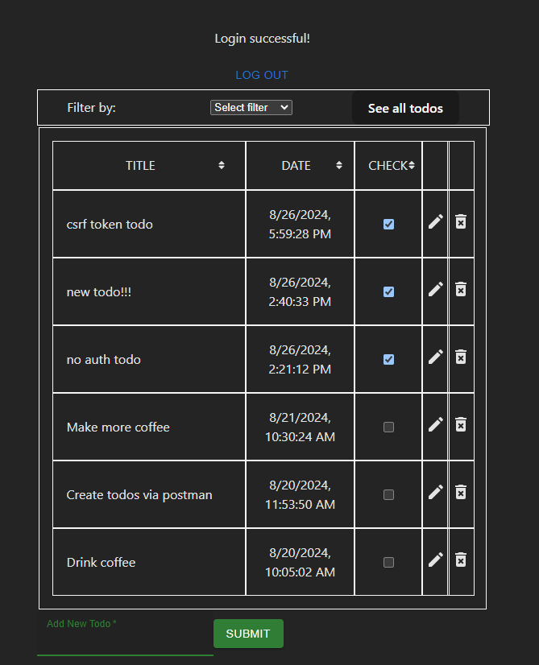
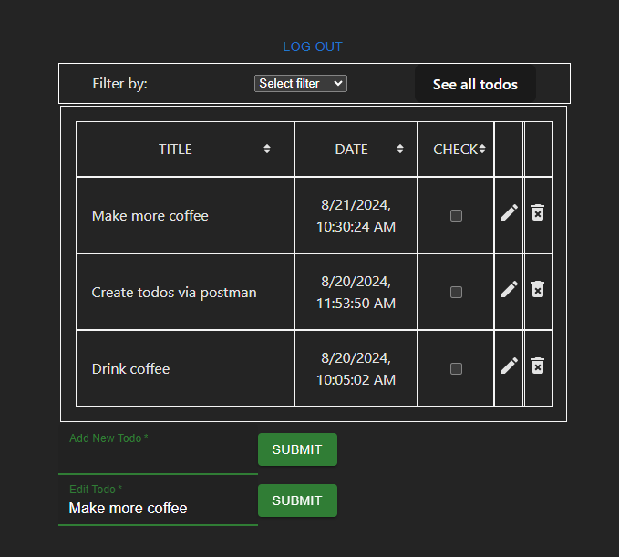

<h1>Filterable and sortable To Do list in TypeScript</h1>
<h3 align="center">Overview</h3>

This is a simple yet functional todo list application built using a Vite + TypeScript setup for the React frontend and a Go backend. The app allows users to sign up, log in, manage their todos, and sort or filter them based on various criteria. It showcases state management using context and reducers, along with custom hooks to handle forms and status messages.

<h3>Features</h3>
<table>

<tr>
<td>User Authenticaton</td>
<td>Sign up, log in, and log out functionalities.</td>
</tr>
<tr>
<td>Todo Management</td>
<td>Add, edit, delete, and toggle the status of todos.</td>
</tr>
<tr>
<td>Sorting and Filtering</td>
<td>Sort todos alphabetically, by date, or by completion status; filter todos based on specific criteria.
</td>
</tr>
<tr>
<td>Responsive Feedback</td>
<td>Status messages for user actions, which disappear after a short time.</td>
</tr>
</table>

<h3>Project Structure</h3>
<code>

            .eslintrc.cjs
            .gitignore
            README.md
            index.html
            package-lock.json
            package.json
            public/vite.svg
            src/
            ├── App.css
            ├── App.tsx
            ├── assets/
            │   ├── screenshots/filter.png
            │   └── screenshots/list.png
            ├── components/
            │   ├── AddNew.tsx
            │   ├── FilterComponent.tsx
            │   ├── FilterTodosForm.tsx
            │   ├── TableHeads.tsx
            │   ├── Todo.tsx
            │   ├── TodoTable.tsx
            │   ├── UpdateTodo.tsx
            │   └── UserSignUpLoginForm.tsx
            ├── context/
            │   ├── todo-context.ts
            │   └── todo-provider.tsx
            ├── data/sampleData.ts
            ├── hooks/
            │   ├── useFormData.tsx
            │   └── useMessage.tsx
            ├── interfaces/interfaces.ts
            ├── main.tsx
            ├── reducer/
            │   ├── todo_reducer.ts
            │   └── user_reducer.ts
            ├── types/types.ts
            ├── utils/
            │   ├── fetchTodos.ts
            │   ├── fetchUser.ts
            │   └── helpers.ts
            ├── vite-env.d.ts
            test/
            ├── helpers.test.ts
            ├── sum.ts
            ├── user-tests.test.ts
            tsconfig.app.json
            tsconfig.json
            tsconfig.node.json
            vite.config.ts

</code>

<h3>Key Components</h3>
<table>
<tr>
<td>App.tsx</td>
<td>The main component that orchestrates the display of todos and user authentication forms. It handles the user session, rendering relevant components based on whether the user is logged in or not.</td>
</tr>
<tr>
<td>TodoProvider.tsx</td>
<td>This component wraps the entire application, providing context for both the todo and user states. It manages the state using two reducers (todoReducer and userReducer) and exposes various functions for todo manipulation, sorting, and filtering.</td>
</tr>
<tr>
<td>TodoTable.tsx</td>
<td>Displays the list of todos along with sorting and filtering options. It contains subcomponents like TableHeads for managing the table headers and Todo for rendering individual todos.</td>
</tr>
<tr>
<td>UserSignUpLoginForm.tsx</td>
<td>Handles user sign-up and login processes, including form submission and error handling.</td>
</tr>
<tr>
<td>useFormData.tsx</td>
<td>A custom hook that manages form state, submission, and data passing to a callback function, making it reusable across multiple forms.</td>
</tr>
<tr>
<td>useMessage.tsx</td>
<td>A custom hook for managing status messages that automatically disappear after a set period, providing user feedback on actions like login, logout, and todo manipulation.</td>
</tr>
</table>

<h3>State Management</h3>

State is managed via context and reducers:

<ul>
<li>Todo State: Managed by todoReducer, includes actions like initializing, creating, updating, deleting, and sorting todos.</li>
<li>User State: Managed by userReducer, handles user authentication and session management.</li>
</ul>

Both states are provided to the entire application via the TodoProvider.

<h3>Utilities</h3>
<ul>
<li>fetchTodos.ts: Contains functions for interacting with the backend API related to todos, including fetching, creating, updating, and deleting todos.</li>
<li>fetchUser.ts: Manages API calls related to user authentication.</li>
<li>helpers.ts: Provides utility functions for sorting and filtering todos.</li>
</ul>

<table>
<tr>
<td></td>
<td></td>
</tr>
</table>

<table>
<tr>
<td></td>
<td></td>
</tr>
</table>

